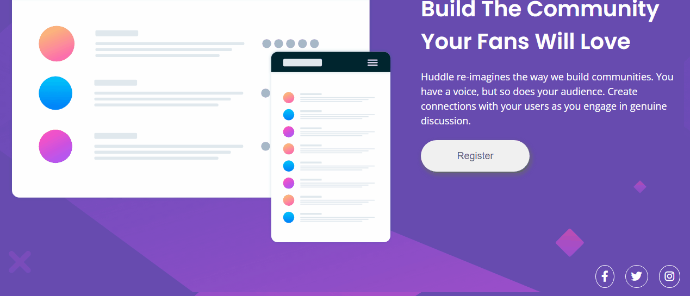
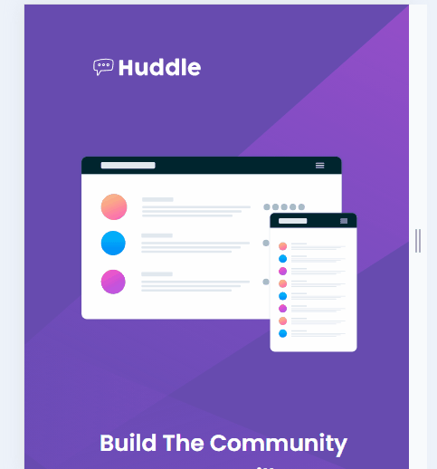

# Primeira Quest - HTML e CSS avançado
Projeto consiste em aplicar os conceitos de html e css para criar página baseado num desafio do FrontEnd Mentor.
## Tecnologias utilizadas
- HTML5
- CSS3
## Objetivos
- Praticar os conteúdos do curso
- Responsividade para os formatos de tela 
- Alinhamento dos elementos
## Designer do Projeto
### Desktop
[]
### Mobile
[]

## Prévia da Aplicação
[]

[]
